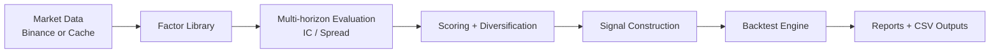
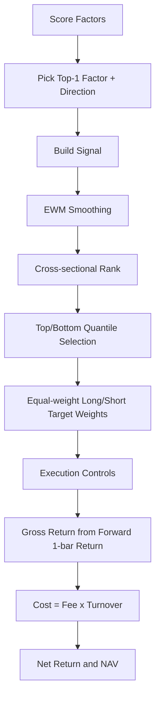

# Alpha Factor Mining (Binance USD-M)

一个面向 Binance USDT 永续合约的因子研究与策略回测框架。

核心目标：
- 快速生成和评估横截面因子
- 自动做去冗余筛选（降低高相关因子重复）
- 对比三类策略（单因子/组合/风控多因子）
- 输出结构化回测报告与事件明细

## Pipeline



执行链路：

`数据拉取/缓存 -> 因子生成 -> 多周期评估 -> 去冗余选因子 -> 组合信号 -> 多策略回测 -> 报告输出`

## Project Structure

```text
config/                  全局参数配置
scripts/run_research.py  运行入口
src/alpha_mining/        核心实现（data/factors/evaluation/backtest/pipeline）
data/cache/              行情缓存
results/                 研究和回测输出
```

## Three Strategies

| Strategy | Core Logic | Positioning |
|---|---|---|
| `single_factor_long_short[...]` | 选择评分最高的单一因子 | 横截面分位多空（等权） |
| `composite_long_short` | 多因子加权合成信号 | 横截面分位多空（等权） |
| `risk_controlled_multi_factor` | 多因子加权 + 波动率约束 | 连续权重 + 风险控制 |

## Single Factor Long/Short Algorithm

`single_factor_long_short` 的回测逻辑：
1. 对因子打分，选择 Top1 因子及方向。
2. 生成信号：`signal = direction * factor_value`。
3. 对信号做 EWM 平滑。
4. 每个时点做横截面排名，取 top/bottom quantile 做多做空。
5. 多空组内等权分配。
6. 应用执行控制（调仓频率、执行 alpha、总暴露缩放）。
7. 计算下一根收益、换手、手续费、净收益。
8. 输出净值、回撤、策略汇总、仓位事件。



## Default Backtest Profile (Conservative)

当前默认参数已切换为保守档：

| Param | Value |
|---|---:|
| `BACKTEST_TOP_QUANTILE` | `0.15` |
| `BACKTEST_MAX_ABS_WEIGHT` | `0.15` |
| `BACKTEST_VOL_LOOKBACK` | `48` |
| `BACKTEST_MULTI_FACTOR_TOP_K` | `6` |
| `BACKTEST_SIGNAL_SMOOTHING_SPAN` | `10` |
| `BACKTEST_EXECUTION_ALPHA` | `0.20` |
| `BACKTEST_REBALANCE_INTERVAL` | `24` |
| `BACKTEST_TARGET_GROSS_EXPOSURE` | `0.80` |
| `FACTOR_CORR_THRESHOLD` | `0.75` |
| `FACTOR_DIVERSIFY_POOL_SIZE` | `80` |

## Quick Start

```bash
python3 -m venv .venv
source .venv/bin/activate
pip install -e .
```

`.env` 示例：

```bash
BINANCE_API_KEY=
BINANCE_SECRET_KEY=
USE_PROXY=False
PROXY_URL=
```

说明：若只使用本地缓存回测，可不填 API Key。

## Run Commands

1. 全流程（刷新交易所数据）

```bash
python3 scripts/run_research.py --refresh-cache
```

2. 仅使用本地缓存（推荐日常迭代）

```bash
python3 scripts/run_research.py --use-cache-only
```

3. 仅策略回测（不重新挖掘全量因子）

```bash
python3 scripts/run_research.py --use-cache-only --strategy-only --selected-top-n 12 --no-charts
```

4. 指定回测区间

```bash
python3 scripts/run_research.py \
  --use-cache-only \
  --strategy-only \
  --no-charts \
  --start-date 2025-01-01 \
  --end-date 2026-03-16
```

## Key Outputs (results/)

- `factor_summary.csv`：主周期因子评估
- `factor_summary_multi_horizon.csv`：多周期聚合评估
- `factor_summary_by_horizon.csv`：分周期明细评估
- `factor_diversification.csv`：去冗余筛选诊断
- `top_strategy_factors.csv`：策略入选因子
- `strategy_returns.csv`：逐bar收益
- `strategy_nav.csv`：净值/权益/回撤
- `strategy_summary.csv`：策略对比（Sharpe/回撤/年化等）
- `strategy_position_events.csv`：仓位变动事件（含触发原因）
- `auto_comparison_report.md`：自动摘要报告

## Notes

- 回测结果对区间、手续费、调仓频率、因子池规模敏感。
- 建议先小规模验证，再扩大 `FACTOR_MAX_COUNT`。
- 若遇到交易所地域限制或网络限制，优先使用缓存模式：`--use-cache-only`。
- 提交仓库前请确保 `.env` 不被追踪。
